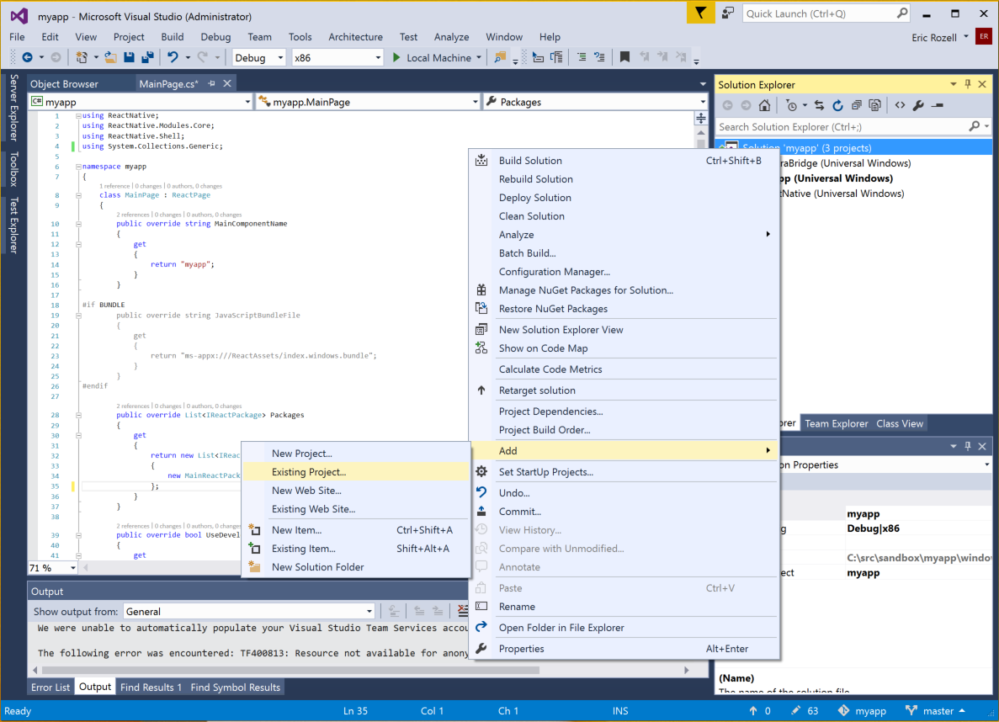
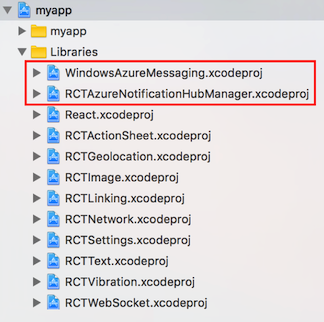

# React Native Azure Notification Hub

React Native module to support Azure Notification Hub push notifications on Android, iOS, and Windows.

# Quick Links

- [Getting Started](#getting-started)
  - [Create a Notification Hub](#create-a-notification-hub)
  - [Android Installation](#android-installation)
  - [Windows Installation](#windows-installation)
  - [iOS Installation](#ios-installation)
  - [JavaScript Configuration](#javascript-configuration)
  - [Publishing Notifications](#publishing-notifications)
- [License](#license)
- [Code of Conduct](#code-of-conduct)

# Prerequisites

## Android

The documentation that follows assumes you have generated a React Native Android project using the `react-native-cli`, i.e.:

```
react-native init myapp
```

In addition to the standard React Native requirements, you will also need to install the following Android SDK components with your prefered SDK management tools:
* Google Play services

## Windows

The documentation that follows assumes you have generated a React Native Windows project using the `react-native-cli` and `rnpm-plugin-windows`, i.e.:

```
react-native init myapp
cd myapp
npm i --save-dev rnpm-plugin-windows
react-native windows
```

It also assumes you have Visual Studio 2015 installed ([Visual Studio Community](https://www.visualstudio.com/en-us/products/visual-studio-community-vs.aspx) is fine).

## iOS

The documentation that follows assumes you have generated a React Native iOS project using the `react-native-cli`, i.e.:

```
react-native init myapp
```

In addition to the standard React Native requirements, you will also need the following:
* An iOS 8 (or later version)-capable device (simulator doesn't work with push notifications)
* [Apple Developer Program](https://developer.apple.com/programs/) membership

# Getting Started

```
npm install react-native-azurenotificationhub
```

## Create a Notification Hub

* Log on to the [Azure Portal](https://portal.azure.com) and create a new **Notification Hub**.


## Android Installation

### Register app with Notification Hub

* Log in to the [Firebase console](https://firebase.google.com/console/) and create a new Firebase project if you don't already have one.
* After your project is created click **Add Firebase to your Android app** and folow the instructions provided.

.

* In the Firebase Console, click the cog for your project and then click **Project Settings**


* Click the **Cloud Messaging** tab in your project settings and copy the value of the **Server key** and **Sender ID**. The former will be used to configure the Notification Hub Access Policy and and the latter for your React Native module registration.

* Back on the [Azure Portal](https://portal.azure.com) page for your notification hub, select **Settings > Notification Services > Google (GCM)**. Enter the FCM **Server key** you copied from the [Firebase console](https://firebase.google.com/console/) and click **Save**.


### Merging of icon resources

In `android/app/src/main/AndroidManifest.xml`

```xml  
    <application
      xmlns:tools="http://schemas.android.com/tools"
      tools:replace="android:icon"
      ...>
    </application>
```

This resolves the error caused by the manifest merger tool for gradle.

### Export React Native Module from app

In `android/settings.gradle`

```gradle
...

include ':react-native-azurenotificationhub'
project(':react-native-azurenotificationhub').projectDir = file('../node_modules/react-native-azurenotificationhub/android')
```

In `android/app/build.gradle`

```gradle
...
dependencies {
    ...

    compile project(':react-native-azurenotificationhub')
    compile 'com.google.android.gms:play-services-gcm:9.4.0'
    compile 'com.google.firebase:firebase-messaging:9.4.0'
}
```

In `android/app/src/main/AndroidManifest.xml`

```xml
    ...
    
    <uses-permission android:name="android.permission.INTERNET"/>
    <uses-permission android:name="android.permission.GET_ACCOUNTS"/>
    <uses-permission android:name="com.google.android.c2dm.permission.RECEIVE" />
    
    <application ...>
      ...
      <service
        android:name="com.azure.reactnative.notificationhub.ReactNativeRegistrationIntentService"
        android:exported="false">
      </service>
      <receiver android:name="com.microsoft.windowsazure.notifications.NotificationsBroadcastReceiver"
        android:permission="com.google.android.c2dm.permission.SEND">
        <intent-filter>
          <action android:name="com.google.android.c2dm.intent.RECEIVE" />
        </intent-filter>
      </receiver>
    ...
```

Register the module package in `MainApplication.java`

```java
import com.azure.reactnative.notificationhub.ReactNativeNotificationHubPackage;

public class MainApplication extends Application implements ReactApplication {

  private final ReactNativeHost mReactNativeHost = new ReactNativeHost(this) {
    @Override
    protected boolean getUseDeveloperSupport() {
      return BuildConfig.DEBUG;
    }

    @Override
    protected List<ReactPackage> getPackages() {
      return Arrays.<ReactPackage>asList(
          new MainReactPackage(),
          new ReactNativeNotificationHubPackage() // <-- Add this package
      );
    }
  };

  ...
}
```

## Windows Installation

### Associate your app with the Windows Store

* Open your Visual Studio .sln (generally ./windows/[app name].sln) file in Visual Studio 2015.
* In Solution Explorer, right-click the Windows Store app project, click **Store**, and then click **Associate App with the Store...**


* Follow the instructions to login, reserve an app name, associate the app with the app name, and automatically configure the required Windows Store registration in the application manifest.

### Register app with Notification Hub

* On the [Windows Dev Center](https://dev.windows.com/overview) page for your new app, click **Services**, click **Push notifications**, and then click **Live Services site** under **Windows Push Notification Services (WNS) and Microsoft Azure Mobile Apps**.


* On the registration page for your app, make a note of the **Application Secret** password and the **Package security identifier** (SID) located in the Windows Store platform settings.


* Back on the [Azure Portal](https://portal.azure.com) page for your notification hub, select **Settings > Notification Services > Windows (WNS)**. Then enter the **Application Secret** password in the Security Key field. Enter your **Package SID** value that you obtained from WNS in the previous section, and then click **Save**.


### Export React Native Module from app

* In Solution Explorer of your open .sln in Visual Studio 2015, right-click the Solution, click **Add > Existing Project...**.



* Assuming you've already installed `react-native-azurenotificationhub` with NPM, find and select `ReactWindowsAzureNotificationHub.csproj` in `.\node_modules\react-native-azurenotificationhub\windows\ReactWindowsAzureNotificationHub`.
* Right-click the Windows Store app project, click ** Add > Reference**, and check `ReactWindowsAzureNotificationHub` from **Projects > Solution**.


* In **MainPage.cs** of your Windows Store app, add the the `ReactAzureNotificationHubPacakge` to your configured set of packages:

```c#
using ReactWindowsAzureNotificationHub;

namespace ...
{
    public class MainPage : ReactPage
    {
        ...
        
        public override List<IReactPackage> Packages
        {
            get
            {
                new List<IReactPackage>
                {
                    new MainReactPackage(),
                    new ReactAzureNotificationHubPackage(), // <-- Add this package
                }
            }
        }
        
        ...
    }
}
```

## iOS Installation

### Generate the Certificate Signing Request file

* On your Mac, run the Keychain Access tool. It can be opened from the **Utilities** folder or the **Other** folder on the launch pad.

* Click **Keychain Access**, expand **Certificate Assistant**, then click **Request a Certificate from a Certificate Authority...**.

  	

* Select your **User Email Address** and **Common Name** , make sure that **Saved to disk** is selected, and then click **Continue**. Leave the **CA Email Address** field blank as it is not required.

  	

* Type a name for the Certificate Signing Request (CSR) file in **Save As**, select the location in **Where**, then click **Save**.

  	

### Register your app for push notifications

* If you have not already registered your app, navigate to the [iOS Provisioning Portal](http://go.microsoft.com/fwlink/p/?LinkId=272456) at the Apple Developer Center, log on with your Apple ID, click **Identifiers**, then click **App IDs**, and finally click on the **+** sign to register a new app.


* Update the following three fields for your new app and then click **Continue**:

  * **Name**: Type a descriptive name for your app in the **Name** field in the **App ID Description** section.

  * **Bundle Identifier**: Under the **Explicit App ID** section, enter a **Bundle Identifier** in the form `<Organization Identifier>.<Product Name>` as mentioned in the [App Distribution Guide](https://developer.apple.com/library/mac/documentation/IDEs/Conceptual/AppDistributionGuide/ConfiguringYourApp/ConfiguringYourApp.html#//apple_ref/doc/uid/TP40012582-CH28-SW8). The *Organization Identifier* and *Product Name* you use must match the organization identifier and product name you will use when you create your XCode project. In the screeshot below *NotificationHubs* is used as a organization idenitifier and *GetStarted* is used as the product name. Making sure this matches the values you will use in your XCode project will allow you to use the correct publishing profile with XCode. 

  * **Push Notifications**: Check the **Push Notifications** option in the **App Services** section, .


* This generates your App ID and requests you to confirm the information. Click **Register** to confirm the new App ID.

* Once you click **Register**, you will see the **Registration complete** screen, as shown below. Click **Done**.


* In the Developer Center, under App IDs, locate the app ID that you just created, and click on its row.


* Clicking on the app ID will display the app details. Click the **Edit** button at the bottom.

* Scroll to the bottom of the screen, and click the **Create Certificate...** button under the section **Development Push SSL Certificate**.


* Click **Choose File**, browse to the location where you saved the CSR file that you created in the first task, then click **Generate**.


* After the certificate is created by the portal, click the **Download** button, and click **Done**.


* Double-click the downloaded push certificate **aps_development.cer**.


* In Keychain Access, right-click the new push certificate that you created in the **Certificates** category. Click **Export**, name the file, select the **.p12** format, and then click **Save**.


### Create a provisioning profile for the app

* Back in the <a href="http://go.microsoft.com/fwlink/p/?LinkId=272456" target="_blank">iOS Provisioning Portal</a>, select **Provisioning Profiles**, select **All**, and then click the **+** button to create a new profile. This launches the **Add iOS Provisioning Profile** Wizard


* Select **iOS App Development** under **Development** as the provisiong profile type, and click **Continue**. 

* Next, select the app ID you just created from the **App ID** drop-down list, and click **Continue**


* In the **Select certificates** screen, select your usual development certificate used for code signing, and click **Continue**. This is not the push certificate you just created.


* Next, select the **Devices** to use for testing, and click **Continue**


* Finally, pick a name for the profile in **Profile Name**, click **Generate**.


* When the new provisioning profile is created click to download it and install it on your Xcode development machine. Then click **Done**.


### Configure your Notification Hub for iOS push notifications

* Back on the [Azure Portal](https://portal.azure.com) page for your notification hub, select **Settings > Notification Services > Apple (APNS)**. Click on **Upload Certificate** and select the **.p12** file that you exported earlier. Make sure you also specify the correct password.

* Make sure to select **Sandbox** mode since this is for development. Only use the **Production** if you want to send push notifications to users who purchased your app from the store.


### Connect your iOS app to Notification Hubs

* Make sure to use the same **Product Name** and **Organization Identifier** that you used when you previously set the bundle ID on the Apple Developer portal, i.e.:

  * Product Name: *myapp*
  * Organization Identifier: *org.reactjs.native.example*

* Remember to set **Provisioning Profile** to the provisioning profile that you created previously.


* Drag **node_modules/react-native-azurenotificationhub/ios/RCTAzureNotificationHubManager.xcodeproj** and **node_modules/react-native-azurenotificationhub/ios/WindowsAzureMessaging.xcodeproj** to your project on Xcode (usually under the Libraries group on Xcode).



* Click on your main project file (the one that represents the **.xcodeproj**), select **Build Phases** and drag the static libraries from the **Products** folder inside the libraries you are importing to **Link Binary With Libraries**


* Add **$(SRCROOT)/../node_modules/react-native-azurenotificationhub/ios** to **Header Search Paths** and select **recursive**


* To enable support for notification and register events you need to augment your AppDelegate. At the top of your **AppDelegate.m**:

```objective-c
#import "RCTAzureNotificationHubManager.h"
```

* And then add the following code in the same file:

```objective-c
// Required to register for notifications
- (void)application:(UIApplication *)application didRegisterUserNotificationSettings:(UIUserNotificationSettings *)notificationSettings
{
    [RCTAzureNotificationHubManager didRegisterUserNotificationSettings:notificationSettings];
}

// Required for the register event.
- (void)application:(UIApplication *)application didRegisterForRemoteNotificationsWithDeviceToken:(NSData *)deviceToken
{
    [RCTAzureNotificationHubManager didRegisterForRemoteNotificationsWithDeviceToken:deviceToken];
}

// Required for the registrationError event.
- (void)application:(UIApplication *)application didFailToRegisterForRemoteNotificationsWithError:(NSError *)error
{
    [RCTAzureNotificationHubManager didFailToRegisterForRemoteNotificationsWithError:error];
}

// Required for the notification event.
- (void)application:(UIApplication *)application didReceiveRemoteNotification:(NSDictionary *)notification
{
    [RCTAzureNotificationHubManager didReceiveRemoteNotification:notification];
}

// Required for the localNotification event.
- (void)application:(UIApplication *)application didReceiveLocalNotification:(UILocalNotification *)notification
{
    [RCTAzureNotificationHubManager didReceiveLocalNotification:notification];
}
```

### XCode 8 changes

With XCode 8, the entitlements are set from your local entitlements file rather than from the provisioning profile you created on the Apple Developer Portal. The entitlements will now need to be added to your Xcode build under Capabilities in addition to in your provisioning profile.


## JavaScript Configuration

On the [Azure Portal](https://portal.azure.com) page for your notification hub, copy a connection string from **Settings > Access Policies**.


The example below shows how you can register and unregister from Azure Notification Hub in your React component.

### Windows

```js
const NotificationHub = require('react-native-azurenotificationhub');

const connectionString = '...'; // The Notification Hub connection string
const hubName = '...';          // The Notification Hub name
const senderID = '...';         // The Sender ID from the Cloud Messaging tab of the Firebase console
const tags = [ ... ];           // The set of tags to subscribe to

class myapp extends Component {
  register() {
    NotificationHub.register({connectionString, hubName, senderID, tags})
      .catch(reason => console.warn(reason));
  }

  unregister() {
    NotificationHub.unregister()
      .catch(reason => console.warn(reason));
  }

  render() {
    return (
      <View style={styles.container}>
        <TouchableOpacity onPress={this.register.bind(this)}>
         <View style={styles.button}>
           <Text style={styles.buttonText}>
             Register
           </Text> 
         </View>
       </TouchableOpacity>
       <TouchableOpacity onPress={this.unregister.bind(this)}>
         <View style={styles.button}>
           <Text style={styles.buttonText}>
             Unregister
           </Text> 
         </View>
       </TouchableOpacity>
      </View>
    );
  }
```

### Android

```js
const NotificationHub = require('react-native-azurenotificationhub');
const PushNotificationEmitter = new NativeEventEmitter(NotificationHub);

const NOTIF_REGISTER_AZURE_HUB_EVENT = 'azureNotificationHubRegistered';
const NOTIF_AZURE_HUB_REGISTRATION_ERROR_EVENT = 'azureNotificationHubRegistrationError';
const DEVICE_NOTIF_EVENT = 'remoteNotificationReceived';

const connectionString = '...'; // The Notification Hub connection string
const hubName = '...';          // The Notification Hub name
const senderID = '...';         // The Sender ID from the Cloud Messaging tab of the Firebase console
const tags = [ ... ];           // The set of tags to subscribe to

class myapp extends Component {
  constructor(props) {
    super(props);
    PushNotificationEmitter.addListener(DEVICE_NOTIF_EVENT, this._onRemoteNotification);
  }

  register() {
    PushNotificationEmitter.addListener(NOTIF_REGISTER_AZURE_HUB_EVENT, this._onAzureNotificationHubRegistered);
    PushNotificationEmitter.addListener(NOTIF_AZURE_HUB_REGISTRATION_ERROR_EVENT, this._onAzureNotificationHubRegistrationError);
  
    NotificationHub.register({connectionString, hubName, senderID, tags})
      .catch(reason => console.warn(reason));
  }

  unregister() {
    NotificationHub.unregister()
      .catch(reason => console.warn(reason));
  }

  render() {
    return (
      <View style={styles.container}>
        <TouchableOpacity onPress={this.register.bind(this)}>
         <View style={styles.button}>
           <Text style={styles.buttonText}>
             Register
           </Text> 
         </View>
       </TouchableOpacity>
       <TouchableOpacity onPress={this.unregister.bind(this)}>
         <View style={styles.button}>
           <Text style={styles.buttonText}>
             Unregister
           </Text> 
         </View>
       </TouchableOpacity>
      </View>
    );
  }
  
  _onAzureNotificationHubRegistered(registrationID) {
    console.warn('RegistrationID: ' + registrationID);
  }
  
  _onAzureNotificationHubRegistrationError(error) {
    console.warn('Error: ' + error);
  }
  
  _onRemoteNotification(notification) {
    console.warn('Notification received: ' + notification);
  }  
```

### iOS

```js
const NotificationHub = require('react-native-azurenotificationhub/index.ios');

const connectionString = '...'; // The Notification Hub connection string
const hubName = '...';          // The Notification Hub name
const senderID = '...';         // The Sender ID from the Cloud Messaging tab of the Firebase console
const tags = [ ... ];           // The set of tags to subscribe to

var remoteNotificationsDeviceToken = '';  // The device token registered with APNS

class myapp extends Component {
  requestPermissions() {
    NotificationHub.addEventListener('register', this._onRegistered);
    NotificationHub.addEventListener('registrationError', this._onRegistrationError);
    NotificationHub.addEventListener('registerAzureNotificationHub', this._onAzureNotificationHubRegistered);
    NotificationHub.addEventListener('azureNotificationHubRegistrationError', this._onAzureNotificationHubRegistrationError);
    NotificationHub.addEventListener('notification', this._onRemoteNotification);
    NotificationHub.addEventListener('localNotification', this._onLocalNotification);

    NotificationHub.requestPermissions();
  }

  register() {
    NotificationHub.register(remoteNotificationsDeviceToken, {connectionString, hubName, senderID, tags});
  }

  unregister() {
    NotificationHub.unregister();
  }

  render() {
    return (
      <View style={styles.container}>
        <TouchableOpacity onPress={this.requestPermissions.bind(this)}>
         <View style={styles.button}>
           <Text style={styles.buttonText}>
             Request permission
           </Text> 
         </View>
       </TouchableOpacity>
       <TouchableOpacity onPress={this.register.bind(this)}>
         <View style={styles.button}>
           <Text style={styles.buttonText}>
             Register
           </Text> 
         </View>
       </TouchableOpacity>
       <TouchableOpacity onPress={this.unregister.bind(this)}>
         <View style={styles.button}>
           <Text style={styles.buttonText}>
             Unregister
           </Text> 
         </View>
       </TouchableOpacity>
      </View>
    );
  }

  _onRegistered(deviceToken) {
    remoteNotificationsDeviceToken = deviceToken;
    AlertIOS.alert(
      'Registered For Remote Push',
      `Device Token: ${deviceToken}`,
      [{
        text: 'Dismiss',
        onPress: null,
      }]
    );
  }

  _onRegistrationError(error) {
    AlertIOS.alert(
      'Failed To Register For Remote Push',
      `Error (${error.code}): ${error.message}`,
      [{
        text: 'Dismiss',
        onPress: null,
      }]
    );
  }

  _onRemoteNotification(notification) {
    AlertIOS.alert(
      'Push Notification Received',
      'Alert message: ' + notification.getMessage(),
      [{
        text: 'Dismiss',
        onPress: null,
      }]
    );
  }

  _onAzureNotificationHubRegistered(registrationInfo) {
    AlertIOS.alert('Registered For Azure notification hub',
      'Registered For Azure notification hub'
      [{
        text: 'Dismiss',
        onPress: null,
      }]
    );
  }

  _onAzureNotificationHubRegistrationError(error) {
    AlertIOS.alert(
      'Failed To Register For Azure Notification Hub',
      `Error (${error.code}): ${error.message}`,
      [{
        text: 'Dismiss',
        onPress: null,
      }]
    );
  }

  _onLocalNotification(notification){
    AlertIOS.alert(
      'Local Notification Received',
      'Alert message: ' + notification.getMessage(),
      [{
        text: 'Dismiss',
        onPress: null,
      }]
    );
  }
}
```

## Publishing Notifications

Coming soon.

# License

The React Native Azure Notification Hub plugin is provided under the [MIT License](LICENSE).

# Code of Conduct

This project has adopted the [Microsoft Open Source Code of Conduct](https://opensource.microsoft.com/codeofconduct/). For more information see the [Code of Conduct FAQ](https://opensource.microsoft.com/codeofconduct/faq/) or contact [opencode@microsoft.com](mailto:opencode@microsoft.com) with any additional questions or comments.
