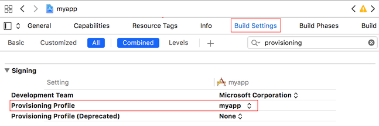
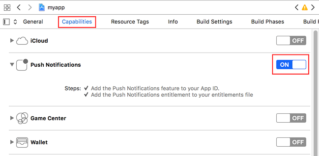

# iOS Installation Guide

## Prerequisites

The documentation that follows assumes you have generated a React Native iOS project using the `react-native-cli`, i.e.:

```
react-native init myapp
```

In addition to the standard React Native requirements, you will also need the following:
* An iOS 8 (or later version)-capable device (simulator doesn't work with push notifications)
* [Apple Developer Program](https://developer.apple.com/programs/) membership

## Install react-native-azurenotificationhub

```
npm install react-native-azurenotificationhub
```

## Create a Notification Hub

* Log on to the [Azure Portal](https://portal.azure.com) and create a new **Notification Hub**.


## Generate the Certificate Signing Request file

* On your Mac, run the Keychain Access tool. It can be opened from the **Utilities** folder or the **Other** folder on the launch pad.

* Click **Keychain Access**, expand **Certificate Assistant**, then click **Request a Certificate from a Certificate Authority...**.

  	

* Select your **User Email Address** and **Common Name** , make sure that **Saved to disk** is selected, and then click **Continue**. Leave the **CA Email Address** field blank as it is not required.

  	

* Type a name for the Certificate Signing Request (CSR) file in **Save As**, select the location in **Where**, then click **Save**.

  	

## Register your app for push notifications

* If you have not already registered your app, navigate to the [iOS Provisioning Portal](http://go.microsoft.com/fwlink/p/?LinkId=272456) at the Apple Developer Center, log on with your Apple ID, click **Identifiers**, then click **App IDs**, and finally click on the **+** sign to register a new app.


* Update the following three fields for your new app and then click **Continue**:

  * **Name**: Type a descriptive name for your app in the **Name** field in the **App ID Description** section.

  * **Bundle Identifier**: Under the **Explicit App ID** section, enter a **Bundle Identifier** in the form `<Organization Identifier>.<Product Name>` as mentioned in the [App Distribution Guide](https://developer.apple.com/library/mac/documentation/IDEs/Conceptual/AppDistributionGuide/ConfiguringYourApp/ConfiguringYourApp.html#//apple_ref/doc/uid/TP40012582-CH28-SW8). The *Organization Identifier* and *Product Name* you use must match the organization identifier and product name you will use when you create your XCode project. In the screeshot below *NotificationHubs* is used as a organization idenitifier and *GetStarted* is used as the product name. Making sure this matches the values you will use in your XCode project will allow you to use the correct publishing profile with XCode. 

  * **Push Notifications**: Check the **Push Notifications** option in the **App Services** section, .


* This generates your App ID and requests you to confirm the information. Click **Register** to confirm the new App ID.

* Once you click **Register**, you will see the **Registration complete** screen, as shown below. Click **Done**.


* In the Developer Center, under App IDs, locate the app ID that you just created, and click on its row.


* Clicking on the app ID will display the app details. Click the **Edit** button at the bottom.

* Scroll to the bottom of the screen, and click the **Create Certificate...** button under the section **Development Push SSL Certificate**.


* Click **Choose File**, browse to the location where you saved the CSR file that you created in the first task, then click **Generate**.


* After the certificate is created by the portal, click the **Download** button, and click **Done**.


* Double-click the downloaded push certificate **aps_development.cer**.


* In Keychain Access, right-click the new push certificate that you created in the **Certificates** category. Click **Export**, name the file, select the **.p12** format, and then click **Save**.


## Create a provisioning profile for the app

* Back in the <a href="http://go.microsoft.com/fwlink/p/?LinkId=272456" target="_blank">iOS Provisioning Portal</a>, select **Provisioning Profiles**, select **All**, and then click the **+** button to create a new profile. This launches the **Add iOS Provisioning Profile** Wizard


* Select **iOS App Development** under **Development** as the provisiong profile type, and click **Continue**. 

* Next, select the app ID you just created from the **App ID** drop-down list, and click **Continue**


* In the **Select certificates** screen, select your usual development certificate used for code signing, and click **Continue**. This is not the push certificate you just created.


* Next, select the **Devices** to use for testing, and click **Continue**


* Finally, pick a name for the profile in **Profile Name**, click **Generate**.


* When the new provisioning profile is created click to download it and install it on your Xcode development machine. Then click **Done**.


## Configure your Notification Hub for iOS push notifications

* Back on the [Azure Portal](https://portal.azure.com) page for your notification hub, select **Settings > Notification Services > Apple (APNS)**. Click on **Upload Certificate** and select the **.p12** file that you exported earlier. Make sure you also specify the correct password.

* Make sure to select **Sandbox** mode since this is for development. Only use the **Production** if you want to send push notifications to users who purchased your app from the store.


## Connect your iOS app to Notification Hubs

* Make sure to use the same **Product Name** and **Organization Identifier** that you used when you previously set the bundle ID on the Apple Developer portal, i.e.:

  * Product Name: *myapp*
  * Organization Identifier: *org.reactjs.native.example*

* Remember to set **Provisioning Profile** to the provisioning profile that you created previously.



* To enable support for notification and register events you need to augment your AppDelegate. At the top of your **AppDelegate.m**:

```objective-c
#import <RNAzureNotificationHub/RCTAzureNotificationHubManager.h>
```

* And then add the following code in the same file:

```objective-c
// Required to register for notifications
- (void)application:(UIApplication *)application didRegisterUserNotificationSettings:(UIUserNotificationSettings *)notificationSettings
{
    [RCTAzureNotificationHubManager didRegisterUserNotificationSettings:notificationSettings];
}

// Required for the register event.
- (void)application:(UIApplication *)application didRegisterForRemoteNotificationsWithDeviceToken:(NSData *)deviceToken
{
    [RCTAzureNotificationHubManager didRegisterForRemoteNotificationsWithDeviceToken:deviceToken];
}

// Required for the registrationError event.
- (void)application:(UIApplication *)application didFailToRegisterForRemoteNotificationsWithError:(NSError *)error
{
    [RCTAzureNotificationHubManager didFailToRegisterForRemoteNotificationsWithError:error];
}

// Required for the notification event.
- (void)application:(UIApplication *)application didReceiveRemoteNotification:(NSDictionary *)notification
{
    [RCTAzureNotificationHubManager didReceiveRemoteNotification:notification];
}

// Required for the localNotification event.
- (void)application:(UIApplication *)application didReceiveLocalNotification:(UILocalNotification *)notification
{
    [RCTAzureNotificationHubManager didReceiveLocalNotification:notification];
}
```

## XCode 8 changes

With XCode 8, the entitlements are set from your local entitlements file rather than from the provisioning profile you created on the Apple Developer Portal. The entitlements will now need to be added to your Xcode build under Capabilities in addition to in your provisioning profile.



## JavaScript Configuration

On the [Azure Portal](https://portal.azure.com) page for your notification hub, copy a connection string from **Settings > Access Policies**.


The example below shows how you can register and unregister from Azure Notification Hub in your React component.

```js
const NotificationHub = require('react-native-azurenotificationhub/index.ios');

const connectionString = '...'; // The Notification Hub connection string
const hubName = '...';          // The Notification Hub name
const tags = [ ... ];           // The set of tags to subscribe to

var remoteNotificationsDeviceToken = '';  // The device token registered with APNS

class myapp extends Component {
  requestPermissions() {
    // register: Fired when the user registers for remote notifications. The
    // handler will be invoked with a hex string representing the deviceToken.
    NotificationHub.addEventListener('register', this._onRegistered);

    // registrationError: Fired when the user fails to register for remote
    // notifications. Typically occurs when APNS is having issues, or the device
    // is a simulator. The handler will be invoked with {message: string, code: number, details: any}.
    NotificationHub.addEventListener('registrationError', this._onRegistrationError);

    // registerAzureNotificationHub: Fired when registration with azure notification hubs successful
    // with object {success: true}
    NotificationHub.addEventListener('registerAzureNotificationHub' this._onAzureNotificationHubRegistered);

    // azureNotificationHubRegistrationError: Fired when registration with azure notification hubs
    // fails with object {message: string, details: any} 
    NotificationHub.addEventListener('azureNotificationHubRegistrationError', this._onAzureNotificationHubRegistrationError);

    // notification: Fired when a remote notification is received. The
    // handler will be invoked with an instance of `AzureNotificationHubIOS`.
    NotificationHub.addEventListener('notification', this._onRemoteNotification);

    // localNotification: Fired when a local notification is received. The
    // handler will be invoked with an instance of `AzureNotificationHubIOS`.
    NotificationHub.addEventListener('localNotification', this._onLocalNotification);

    // Requests notification permissions from iOS, prompting the user's
    // dialog box. By default, it will request all notification permissions, but
    // a subset of these can be requested by passing a map of requested
    // permissions.
    // The following permissions are supported:
    //  - `alert`
    //  - `badge`
    //  - `sound`
    //
    // returns a promise that will resolve when the user accepts,
    // rejects, or if the permissions were previously rejected. The promise
    // resolves to the current state of the permission of 
    // {alert: boolean, badge: boolean,sound: boolean }
    NotificationHub.requestPermissions();
  }

  register() {
    NotificationHub.register(remoteNotificationsDeviceToken, {connectionString, hubName, tags});
  }

  unregister() {
    NotificationHub.unregister();
  }

  render() {
    return (
      <View style={styles.container}>
        <TouchableOpacity onPress={this.requestPermissions.bind(this)}>
         <View style={styles.button}>
           <Text style={styles.buttonText}>
             Request permission
           </Text> 
         </View>
       </TouchableOpacity>
       <TouchableOpacity onPress={this.register.bind(this)}>
         <View style={styles.button}>
           <Text style={styles.buttonText}>
             Register
           </Text> 
         </View>
       </TouchableOpacity>
       <TouchableOpacity onPress={this.unregister.bind(this)}>
         <View style={styles.button}>
           <Text style={styles.buttonText}>
             Unregister
           </Text> 
         </View>
       </TouchableOpacity>
      </View>
    );
  }

  _onRegistered(deviceToken) {
    remoteNotificationsDeviceToken = deviceToken;
    AlertIOS.alert(
      'Registered For Remote Push',
      `Device Token: ${deviceToken}`,
      [{
        text: 'Dismiss',
        onPress: null,
      }]
    );
  }

  _onRegistrationError(error) {
    AlertIOS.alert(
      'Failed To Register For Remote Push',
      `Error (${error.code}): ${error.message}`,
      [{
        text: 'Dismiss',
        onPress: null,
      }]
    );
  }

  _onRemoteNotification(notification) {
    AlertIOS.alert(
      'Push Notification Received',
      'Alert message: ' + notification.getMessage(),
      [{
        text: 'Dismiss',
        onPress: null,
      }]
    );
  }

  _onAzureNotificationHubRegistered(registrationInfo) {
    AlertIOS.alert('Registered For Azure notification hub',
      'Registered For Azure notification hub'
      [{
        text: 'Dismiss',
        onPress: null,
      }]
    );
  }

  _onAzureNotificationHubRegistrationError(error) {
    AlertIOS.alert(
      'Failed To Register For Azure Notification Hub',
      `Error (${error.code}): ${error.message}`,
      [{
        text: 'Dismiss',
        onPress: null,
      }]
    );
  }

  _onLocalNotification(notification){
    // Note notification will be object for iOS
    AlertIOS.alert(
      'Local Notification Received',
      'Alert message: ' + notification.getMessage(),
      [{
        text: 'Dismiss',
        onPress: null,
      }]
    );
  }
}
```
