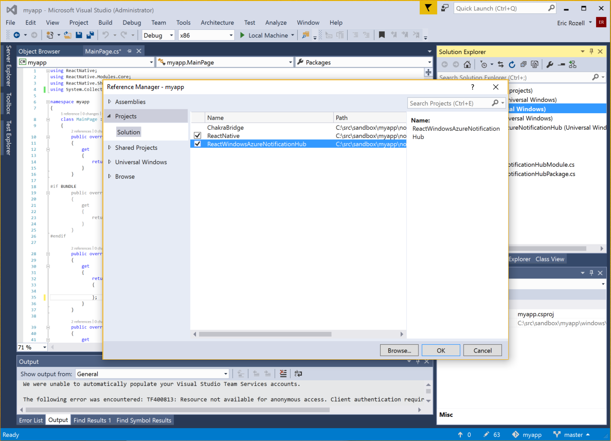

# Windows Installation Guide

## Prerequisites

The documentation that follows assumes you have generated a React Native Windows project using the `react-native-cli` and `rnpm-plugin-windows`, i.e.:

```
react-native init myapp
cd myapp
npm i --save-dev rnpm-plugin-windows
react-native windows
```

It also assumes you have Visual Studio 2015 installed ([Visual Studio Community](https://www.visualstudio.com/en-us/products/visual-studio-community-vs.aspx) is fine).

## Install react-native-azurenotificationhub

```
npm install react-native-azurenotificationhub
```

## Create a Notification Hub

* Log on to the [Azure Portal](https://portal.azure.com) and create a new **Notification Hub**.


## Associate your app with the Windows Store

* Open your Visual Studio .sln (generally ./windows/[app name].sln) file in Visual Studio 2015.
* In Solution Explorer, right-click the Windows Store app project, click **Store**, and then click **Associate App with the Store...**


* Follow the instructions to login, reserve an app name, associate the app with the app name, and automatically configure the required Windows Store registration in the application manifest.

## Register app with Notification Hub

* On the [Windows Dev Center](https://dev.windows.com/overview) page for your new app, click **Services**, click **Push notifications**, and then click **Live Services site** under **Windows Push Notification Services (WNS) and Microsoft Azure Mobile Apps**.


* On the registration page for your app, make a note of the **Application Secret** password and the **Package security identifier** (SID) located in the Windows Store platform settings.


* Back on the [Azure Portal](https://portal.azure.com) page for your notification hub, select **Settings > Notification Services > Windows (WNS)**. Then enter the **Application Secret** password in the Security Key field. Enter your **Package SID** value that you obtained from WNS in the previous section, and then click **Save**.


## Export React Native Module from app

* In Solution Explorer of your open .sln in Visual Studio 2015, right-click the Solution, click **Add > Existing Project...**.


* Assuming you've already installed `react-native-azurenotificationhub` with NPM, find and select `ReactWindowsAzureNotificationHub.csproj` in `.\node_modules\react-native-azurenotificationhub\windows\ReactWindowsAzureNotificationHub`.
* Right-click the Windows Store app project, click ** Add > Reference**, and check `ReactWindowsAzureNotificationHub` from **Projects > Solution**.



* In **MainPage.cs** of your Windows Store app, add the the `ReactAzureNotificationHubPacakge` to your configured set of packages:

```c#
using ReactWindowsAzureNotificationHub;

namespace ...
{
    public class MainPage : ReactPage
    {
        ...
        
        public override List<IReactPackage> Packages
        {
            get
            {
                new List<IReactPackage>
                {
                    new MainReactPackage(),
                    new ReactAzureNotificationHubPackage(), // <-- Add this package
                }
            }
        }
        
        ...
    }
}
```

## JavaScript Configuration

On the [Azure Portal](https://portal.azure.com) page for your notification hub, copy a connection string from **Settings > Access Policies**.


The example below shows how you can register and unregister from Azure Notification Hub in your React component.

```js
const NotificationHub = require('react-native-azurenotificationhub');

const connectionString = '...'; // The Notification Hub connection string
const hubName = '...';          // The Notification Hub name
const senderID = '...';         // The Sender ID from the Cloud Messaging tab of the Firebase console
const tags = [ ... ];           // The set of tags to subscribe to

class myapp extends Component {
  register() {
    NotificationHub.register({connectionString, hubName, senderID, tags})
      .catch(reason => console.warn(reason));
  }

  unregister() {
    NotificationHub.unregister()
      .catch(reason => console.warn(reason));
  }

  render() {
    return (
      <View style={styles.container}>
        <TouchableOpacity onPress={this.register.bind(this)}>
         <View style={styles.button}>
           <Text style={styles.buttonText}>
             Register
           </Text> 
         </View>
       </TouchableOpacity>
       <TouchableOpacity onPress={this.unregister.bind(this)}>
         <View style={styles.button}>
           <Text style={styles.buttonText}>
             Unregister
           </Text> 
         </View>
       </TouchableOpacity>
      </View>
    );
  }
```
